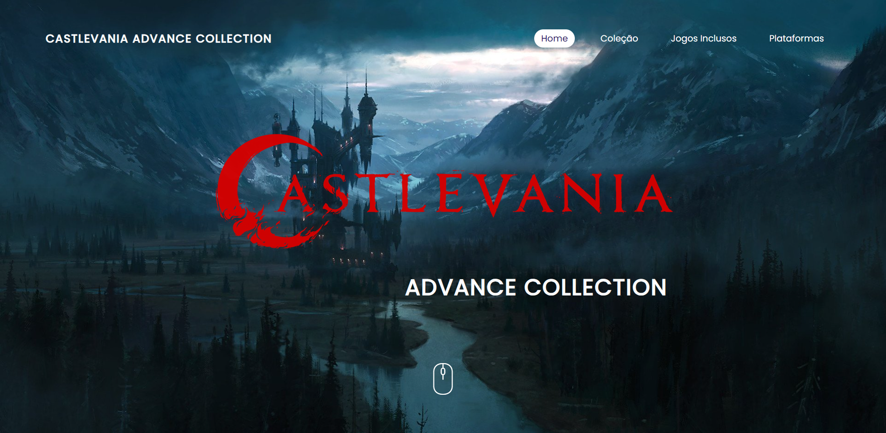

# Castlevania Advance Collection Website

My first website project, based on the Castlevania Advance Collection. Held on December 6, 2021

The site features basic HTML and CSS coding. I chose the Castlevania theme for the website because at the time I was learning these programming languages I had just purchased this game collection.

The website content contains information about the games in the Castlevania Advance collection and the platforms they are available to play on.

## Installation
1. Clone the repository.
2. Start the application by opening with Live Server.
